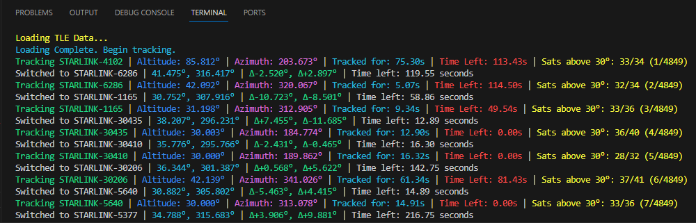

# StarlinkNavigator



## Overview
This Python-based Satellite Tracking System is designed for tracking the position of Starlink satellites in real-time. It incorporates Skyfield for precise astronomical calculations, supporting dynamic updates of satellite positions and alerting when satellites fall below a specified altitude threshold.

## Key Features
- **Real-Time Satellite Tracking:** Automatically updates the position of satellites, displaying current altitude and azimuth.
- **Altitude Threshold Alert:** Notifies when a satellite's altitude dips below 30 degrees.
- **Closest Satellite Identification:** Facilitates seamless switching between satellites for continuous tracking.
- **Audio Alerts:** Utilizes audio signals for tracking notifications and transitions.
- **Live TLE Data Retrieval:** Fetches up-to-date TLE (Two-Line Element) data from Celestrak for accurate tracking.
- **Configurable Observation Point:** Allows setting of specific latitude and longitude for tailored tracking.

## Installation

### Prerequisites
- Python 3.x
- Required Libraries: `skyfield`, `scipy`, `datetime`, `keyboard`, `winsound` (for Windows), `heapq`, `time`, `os`
- Internet connection for TLE data update

### Setup Instructions
1. **Python Installation:** Ensure Python 3.x is installed on your system.
2. **Library Installation:** Use `pip` to install the necessary libraries:
   ```bash
   pip install skyfield scipy keyboard
   ```
   Note: `winsound` is available on Windows. For Linux, use equivalent audio libraries.

3. **Script Download:** Obtain the Python script and save it to your preferred directory.

## Usage

1. **Execution:**
   Navigate to the script directory and run the script:
   ```bash
   python satellite_tracking.py
   ```

2. **Operation:**
   - **Switch Satellite:** Press 'Spacebar' to switch to the closest satellite.
   - **Exit Program:** Press 'Escape' key to terminate the program.

3. **Customization:**
   Modify the observer's latitude and longitude in the script to align with your specific location.

## Limitations
- Primarily tailored for Starlink satellites; may require adjustments for other constellations.
- Audio alerts are supported on Windows and need alternative solutions for other operating systems.

---
